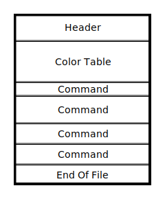

# Tiny Vector Graphics (Specification)

**Abstract:** The tiny vector graphics format is a binary file format that encodes a list of vector graphic primitives.

## Intruction

### Why a new format

SVG is the status quo widespread vector format. Every program can kinda use it and can probably render it right. The problem is that SVG is a horribly large specification, it is based on XML and provides not only vector graphics, but also a full suite for animation and JavaScript scripting. Implementing a new SVG renderer from scratch is a tremendous amount of work, and it is hard to get it done right.

Quoting the [german Wikipedia](https://de.wikipedia.org/wiki/Scalable_Vector_Graphics):

> 🇩🇪 Praktisch alle relevanten Webbrowser können einen Großteil des Sprachumfangs darstellen.  
> 🇺🇸 Virtually all relevant web browsers can display a large part of the language range.

The use of XML bloats the files by a huge magnitude and doesn't provide a efficient encoding, thus a lot of websites and applications ship files that are not encoded optimally. Also SVG allows several ways of achieving the same thing, and can be seen more as a intermediate format for editing as for final encoding.

TVG was created to adress most of these problems, trying to achieve a balance between flexibility and file size, while keeping file size as the more important priority.

### Features

- Binary encoding
- Support of the most common 2D vector primitives
  - Paths
  - Polygons
  - Rectangles
  - Lines
- 3 different fill styles
  - Flat color
  - Linear 2-point gradient
  - Radial 2-point gradient
- Dense encoding, there are near zero padding bits and every byte is used as good as possible.

## Format

TVG files are roughly structured like this:

Files are made up of a header, followed by a color lookup table and a sequence of commands terminated by a _end of file_ command.

**NOTE:** The following documentation uses a tabular style to document structures. All integers are assumed to be encoded in little-endian byte order.
The _Type_ column of each structure definition uses a Zig notation for types and each field is padded with zero bits to the previous one.
If a field does not align to a byte boundary, the next field will be offset into the byte by the current fields bit size. This means, that two consecutive fields **a** (`u3`) and **b** (`u5`) can be extracted from the byte by using `(byte & 0x7) >> 0` for **a** and `(byte & 0x1F) >> 3` for **b**.

### Header

Each TVG file starts with a header defining some global values for the file like scale and image size. The header is always at offset 0 in a file.

| Field            | Type                 | Description                                                                                                                                                                                   |
| ---------------- | -------------------- | --------------------------------------------------------------------------------------------------------------------------------------------------------------------------------------------- |
| magic            | `[2]u8`              | Must be `{ 0x72, 0x56 }`                                                                                                                                                                      |
| version          | `u8`                 | Must be `1`. For future versions, this field might decide how the rest of the format looks like.                                                                                              |
| scale            | `u4`                 | Defines the number of fraction bits in a [`Unit`](#units) value.                                                                                                                              |
| color_encoding   | `u2`                 | Defines the type of color information that is used in the [color table](#color-table).                                                                                                        |
| coordinate_range | `u2`                 | Defines the number of total bits in a [`Unit`](#units) value and thus the overall precision of the file.                                                                                      |
| width            | `u8`, `u16` or `u32` | Encodes the maximum width of the output file in pixels. A value of 0 indicates that the image has the maximum possible width. The size of this field depends on the coordinate range field.   |
| height           | `u8`, `u16` or `u32` | Encodes the maximum height of the output file in pixels. A value of 0 indicates that the image has the maximum possible height. The size of this field depends on the coordinate range field. |
| color_count      | `VarUInt`            | The number of colors in the [color table](#color-table).                                                                                                                                      |

#### Color Encoding

The color encoding defines which format the colors in the color table will have:

| Value | Enumeration | Description                                                                                                                                                                                                                                              |
| ----- | ----------- | -------------------------------------------------------------------------------------------------------------------------------------------------------------------------------------------------------------------------------------------------------- |
| 0     | RGBA 8888   | Each color is a 4-tuple (red, green ,blue, alpha) of bytes with the color channels encoded in sRGB and the alpha as linear alpha.                                                                                                                        |
| 1     | RGB 565     | Each color is encoded as a 3-tuple (red, green, blue) with 16 bit per color. While red and blue both use 5 bit, the green channel uses 6 bit. red uses bit range 0...4, green bits 5...10 and blue bits 11...15.                                         |
| 2     | RGBA F32    | Each color is a 4-tuple (red, green ,blue, alpha) of binary32 IEEE 754 floating point value with the color channels encoded in sRGB and the alpha as linear alpha. A color value of `1.0` is full brightness, while a value of `0.0` is zero brightness. |
| 3     | Custom      | The custom color encoding is _defined undefined_. The information how these colors are encoded must be implemented via external means.                                                                                                                   |

#### Coordinate Range

The coordinate range defines how many bits a [`Unit`](#units) value uses:

| Value | Enumeration | Description                  |
| ----- | ----------- | ---------------------------- |
| 0     | Default     | Each `Unit` takes up 8 bit.  |
| 1     | Reduced     | Each `Unit` takes up 16 bit. |
| 2     | Enhanced    | Each `Unit` takes up 32 bit. |

### Color Table

YADA YADA

### Commands

YADA YADA

### Unit

The unit is the common type for both positions and sizes in the vector graphic. It is encoded as a signed integer with a configurable amount of bits (see [Coordinate Range](#coordinate-range)) and fractional bits.

The file header defines a _scale_ by which each signed integer is divided into the final value. For example, with a _reduced_ value of `0x13` and a scale of `4`, we get the final value of 1.1875, as the number is interpretet as binary `b0001.0011`.

## Revision History

### 1.0

- Initial release
