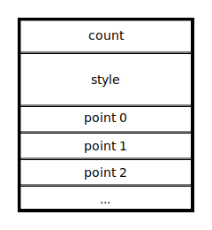

# Tiny Vector Graphics (Specification)

**Abstract:** The tiny vector graphics format is a binary file format that encodes a list of vector graphic primitives. It is tailored to have a tiny memory footprint and simple implementations, while lifting small file size over encoding simplicity.

## Intruction

### Why a new format

SVG is the status quo widespread vector format. Every program can kinda use it and can probably render it right to some extend. The problem is that SVG is a horribly large specification, it is based on XML and provides not only vector graphics, but also a full suite for animation and JavaScript scripting. Implementing a new SVG renderer from scratch is a tremendous amount of work, and it is hard to get it done right.

Quoting the [german Wikipedia](https://de.wikipedia.org/wiki/Scalable_Vector_Graphics):

> 🇩🇪 Praktisch alle relevanten Webbrowser können einen Großteil des Sprachumfangs darstellen.  
> 🇺🇸 Virtually all relevant web browsers can display a large part of the language range.

The use of XML bloats the files by a huge magnitude and doesn't provide a efficient encoding, thus a lot of websites and applications ship files that are not encoded optimally. Also SVG allows several ways of achieving the same thing, and can be seen more as a intermediate format for editing as for final encoding.

TinyVG was created to adress most of these problems, trying to achieve a balance between flexibility and file size, while keeping file size as the more important priority.

### Features

- Binary encoding
- Support of the most common 2D vector primitives
  - Paths
  - Polygons
  - Rectangles
  - Lines
- 3 different fill styles
  - Flat color
  - Linear 2-point gradient
  - Radial 2-point gradient
- Dense encoding, there are near zero padding bits and every byte is used as good as possible.

## Format

TVG files are roughly structured like this:


Files are made up of a header, followed by a color lookup table and a sequence of commands terminated by a _end of file_ command.

Concrete color values will only be present in the color table. After the table, only indices into the color table are used to define color values. This allows to keep the format small, as the first 128 colors in the vector data are encoded as only a single byte, even if the color format uses 16 bytes per color. This means in the worst case, we add a single byte to the size of a color that is only used once, but colors that are common in the file will be encoded as a single byte per use + one time overhead. This encoding scheme was chosen as a vector graphic typically doesn't use as much different colors as bitmap graphics and thus can be encoded more optimally.

**NOTE:** The following documentation uses a tabular style to document structures. All integers are assumed to be encoded in little-endian byte order if not specified otherwise.
The _Type_ column of each structure definition uses a Zig notation for types and the fields have no padding bits inbetween.
If a field does not align to a byte boundary, the next field will be offset into the byte by the current fields bit offset + bit size. This means, that two consecutive fields **a** (`u3`) and **b** (`u5`) can be extracted from the byte by using `(byte & 0x7) >> 0` for **a** and `(byte & 0x1F) >> 3` for **b**.

### Coordinate system

TinyVG uses the 2-dimensional [Cartesian coordinate system](https://en.wikipedia.org/wiki/Cartesian_coordinate_system) with X being the positive horizontal distance to the origin and Y being the negative vertical distance to the origin. This means that X is going right, while Y is going down, to match the coordinate system of several other image formats:


### Header

Each TVG file starts with a header defining some global values for the file like scale and image size. The header is always at offset 0 in a file.

| Field            | Type                 | Description                                                                                                                                                                                   |
| ---------------- | -------------------- | --------------------------------------------------------------------------------------------------------------------------------------------------------------------------------------------- |
| magic            | `[2]u8`              | Must be `{ 0x72, 0x56 }`                                                                                                                                                                      |
| version          | `u8`                 | Must be `1`. For future versions, this field might decide how the rest of the format looks like.                                                                                              |
| scale            | `u4`                 | Defines the number of fraction bits in a [`Unit`](#units) value.                                                                                                                              |
| color_encoding   | `u2`                 | Defines the type of color information that is used in the [color table](#color-table).                                                                                                        |
| coordinate_range | `u2`                 | Defines the number of total bits in a [`Unit`](#units) value and thus the overall precision of the file.                                                                                      |
| width            | `u8`, `u16` or `u32` | Encodes the maximum width of the output file in pixels. A value of 0 indicates that the image has the maximum possible width. The size of this field depends on the coordinate range field.   |
| height           | `u8`, `u16` or `u32` | Encodes the maximum height of the output file in pixels. A value of 0 indicates that the image has the maximum possible height. The size of this field depends on the coordinate range field. |
| color_count      | `VarUInt`            | The number of colors in the [color table](#color-table).                                                                                                                                      |

#### Color Encoding

The color encoding defines which format the colors in the color table will have:

| Value | Enumeration | Description                                                                                                                                                                                                                                              |
| ----- | ----------- | -------------------------------------------------------------------------------------------------------------------------------------------------------------------------------------------------------------------------------------------------------- |
| 0     | RGBA 8888   | Each color is a 4-tuple (red, green ,blue, alpha) of bytes with the color channels encoded in sRGB and the alpha as linear alpha.                                                                                                                        |
| 1     | RGB 565     | Each color is encoded as a 3-tuple (red, green, blue) with 16 bit per color. While red and blue both use 5 bit, the green channel uses 6 bit. red uses bit range 0...4, green bits 5...10 and blue bits 11...15.                                         |
| 2     | RGBA F32    | Each color is a 4-tuple (red, green ,blue, alpha) of binary32 IEEE 754 floating point value with the color channels encoded in sRGB and the alpha as linear alpha. A color value of `1.0` is full brightness, while a value of `0.0` is zero brightness. |
| 3     | Custom      | The custom color encoding is _defined undefined_. The information how these colors are encoded must be implemented via external means.                                                                                                                   |

#### Coordinate Range

The coordinate range defines how many bits a [`Unit`](#units) value uses:

| Value | Enumeration | Description                  |
| ----- | ----------- | ---------------------------- |
| 0     | Default     | Each `Unit` takes up 8 bit.  |
| 1     | Reduced     | Each `Unit` takes up 16 bit. |
| 2     | Enhanced    | Each `Unit` takes up 32 bit. |

#### `VarUInt`

This type is used to encode 32 bit unsigned integers while keeping the number of bytes low. It is encoded as a variable-sized integer that uses 7 bit per byte for integer bits and the 7th bit to encode that there is "more bits available".

The integer is still built as a little-endian, so the first byte will always encode bits 0…6, the second one encodes 8…13, and so on. Bytes are read until the upper-most bit in the byte is set. The bit mappings are done as following:

| Byte | Bit Range | Notes                                                                |
| ---- | --------- | -------------------------------------------------------------------- |
| #1   | 0...6     | This byte must always be present.                                    |
| #2   | 7...13    |                                                                      |
| #3   | 14...20   |                                                                      |
| #4   | 21...27   |                                                                      |
| #5   | 28...31   | This byte must always have the uppermost 4 bits set as `0b1000????`. |

So a `VarUInt` always has between 1 and 5 bytes while mapping the full range of a 32 bit value. This means we only have 5 bit overhead in the worst case, but for all smaller values, we reduce the number of bytes for encoding unsigned integers.

##### Example Code

```cs
fn read() u32 {
    var count = 0;
    var result = 0;
    while (true) {
        const byte = readByte();
        const val = (byte & 0x7F) << (7 * count);
        result |= val;
        if ((byte & 0x80) == 0)
            break;
        count += 1;
    }
    return result;
}

fn write(value: u32) void {
    var iter = value;
    while (iter >= 0x80) {
        writeByte(0x80 | (iter & 0x7F));
        iter >>= 7;
    }
    writeByte(iter);
}
```

### Color Table

The color table encodes the palette for this file. It's binary content is defined by the `color_encoding` field in the header. For the three defined color encodings, each will yield a list of `color_count` RGBA tuples.

#### RGBA 8888

Each color value is encoded as a sequence of four bytes:

| Field | Type | Description                                                               |
| ----- | ---- | ------------------------------------------------------------------------- |
| red   | `u8` | Red color channel between 0.0 and 1.0, mapped to byte values 0 to 255.    |
| green | `u8` | Green color channel between 0.0 and 1.0, mapped to byte values 0 to 255.  |
| blue  | `u8` | Blue color channel between 0.0 and 1.0, mapped to byte values 0 to 255.   |
| alpha | `u8` | Transparency channel between 0.0 and 1.0, mapped to byte values 0 to 255. |

The size of the color table is `4 * color_count`.

#### RGB 565

Each color value is encoded as a sequence of 2 bytes:

| Field | Type | Description                                                                |
| ----- | ---- | -------------------------------------------------------------------------- |
| red   | `u5` | Red color channel between 0.0 and 1.0, mapped to integer values 0 to 31.   |
| green | `u6` | Green color channel between 0.0 and 1.0, mapped to integer values 0 to 63. |
| blue  | `u5` | Blue color channel between 0.0 and 1.0, mapped to integer values 0 to 31.  |

The size of the color table is `2 * color_count`, and all colors are fully opaque.

#### RGBA F32

Each color value is encoded as a sequence of 16 bytes:

| Field | Type  | Description                               |
| ----- | ----- | ----------------------------------------- |
| red   | `f32` | Red color channel between 0.0 and 1.0.    |
| green | `f32` | Green color channel between 0.0 and 1.0.  |
| blue  | `f32` | Blue color channel between 0.0 and 1.0.   |
| alpha | `f32` | Transparency channel between 0.0 and 1.0. |

The size of the color table is `16 * color_count`.

#### Custom

The TinyVG specification does not describe the size nor format of this kind of color table. A implementation specific format is expected. A conforming parser is allowed to reject files with this color format as "unsupported".

### Commands

TinyVG files contain a sequence of draw commands that must be executed in the defined order to get the final result. Each draw command adds a new 2D primitive to the graphic.

The following commands are available:

| Command Index | Name                    | Short description                                                    |
| ------------- | ----------------------- | -------------------------------------------------------------------- |
| 0             | end of document         | This command determines the end of file.                             |
| 1             | fill polygon            | This command fills a N-gon.                                          |
| 2             | fill rectangles         | This command fills a set of rectangles.                              |
| 3             | fill path               | This command fills a free-form path.                                 |
| 4             | draw lines              | This command draws a set of lines.                                   |
| 5             | draw line loop          | This command draws the outline of a polygon.                         |
| 6             | draw line strip         | This command draws a list of end-to-end lines.                       |
| 7             | draw line path          | This command draws a free-form path.                                 |
| 8             | outline fill polygon    | This command combines the fill and draw polygon command into one.    |
| 9             | outline fill rectangles | This command combines the fill and draw rectangles command into one. |
| 10            | outline fill path       | This command combines the fill and draw path command into one.       |

Each command is encoded as a single byte which is split into fields:

| Field              | Type | Description                                             |
| ------------------ | ---- | ------------------------------------------------------- |
| command_index      | `u6` | The command that is encoded next. See table above.      |
| primary_style_kind | `u2` | The type of style this command uses as a primary style. |

#### End Of Document

If this command is read, the TinyVG file has ended. This command must have `primary_style_kind` to be set to 0, so the last byte of every TinyVG file is `0x00`.

Every byte after this command is considered not part of the TinyVG data and can be used for other purposes like meta data or similar.

#### Fill Polygon

Fills a [polygon](https://en.wikipedia.org/wiki/Polygon) with N points.

The command is structured like this:



| Field       | Type                        | Description                                                     |
| ----------- | --------------------------- | --------------------------------------------------------------- |
| point_count | [`VarUInt`](#varuint)       | The number of points in the polygon. This value is offset by 1. |
| fill_style  | `Style(primary_style_kind)` | The style that is used to fill the polygon.                     |
| polygon     | `[count]Point`              | The points of the polygon.                                      |

The offset in `point_count` is there due to 0 points don't make sense at all and the command could just be skipped instead of encoding it with 0 points. The offset is zero to allow code sharing between other fill commands, as each fill command shares the same header.

`point_count` must be at least 3, files that encode another value must be discarded as "invalid" by a conforming implementation.

The polygon specified in `polygon` must be drawn using the [even-odd rule](https://en.wikipedia.org/wiki/Even%E2%80%93odd_rule), that means that if for any point to be inside the polygon, a line to infinity must cross an even number of polygon segments.

##### `Point`

Points are a X and Y coordinate pair:

| Field | Type             | Description                                     |
| ----- | ---------------- | ----------------------------------------------- |
| x     | [`Unit`](#units) | Horizontal distance of the point to the origin. |
| y     | [`Unit`](#units) | Vertical distance of the point to the origin.   |

##### Units

The unit is the common type for both positions and sizes in the vector graphic. It is encoded as a signed integer with a configurable amount of bits (see [Coordinate Range](#coordinate-range)) and fractional bits.

The file header defines a _scale_ by which each signed integer is divided into the final value. For example, with a _reduced_ value of `0x13` and a scale of `4`, we get the final value of 1.1875, as the number is interpretet as binary `b0001.0011`.

#### Fill Rectangles

#### Fill Path

#### Draw Lines

#### Draw Line Loop

#### Draw Line Strip

#### Draw Line Path

#### Outline Fill Polygon

#### Outline Fill Rectangles

#### Outline Fill Path

## Revision History

### 1.0

- Initial release
