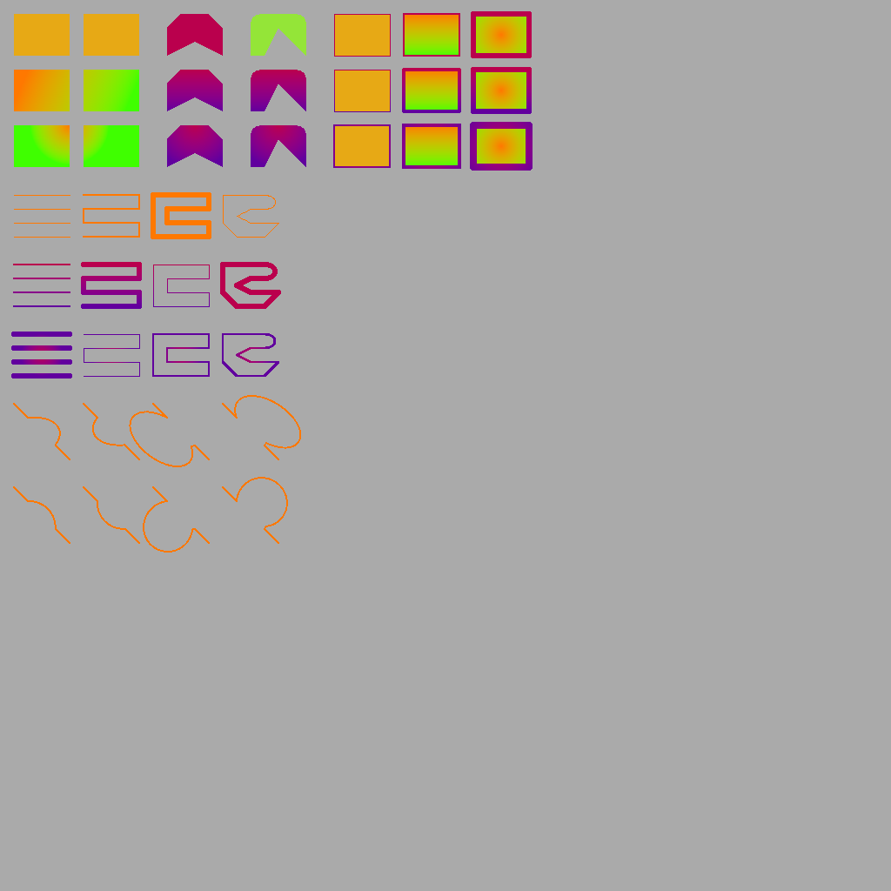

# Example Files

## `app_menu.tvg`

| File Type | Size (Bytes) | Size (Relative) |
|-----------|--------------|-----------------|
| TVG       | 72  | 100%            |
| PNG       | 86  | 119% |

## `feature-showcase.tvg`

| File Type | Size (Bytes) | Size (Relative) |
|-----------|--------------|-----------------|
| TVG       | 1247  | 100%            |
| PNG       | 26567  | 2130% |

## `shield.tvg`

| File Type | Size (Bytes) | Size (Relative) |
|-----------|--------------|-----------------|
| TVG       | 207  | 100%            |
| PNG       | 169  | 81% |

## `workspace_add.tvg`

| File Type | Size (Bytes) | Size (Relative) |
|-----------|--------------|-----------------|
| TVG       | 85  | 100%            |
| PNG       | 126  | 148% |

## `workspace.tvg`

| File Type | Size (Bytes) | Size (Relative) |
|-----------|--------------|-----------------|
| TVG       | 56  | 100%            |
| PNG       | 120  | 214% |

