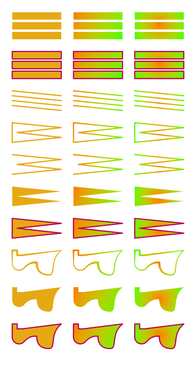

# Example Files

## `everything-32.tvg` (400x768)



| File Type | Size (Bytes) | Size (Relative) |
|-----------|--------------|-----------------|
| TVG       | 2637  | 100%            |
| PNG       | 33945  | 1287% |

<details>
<summary>Textual Representation</summary>

```
(tvg
  (1 32 400 768)
  (
    (9.05882358e-01 6.62745118e-01 8.23529437e-02 1.0e+00)
    (1.0e+00 4.70588237e-01 0.0e+00 1.0e+00)
    (2.50980406e-01 1.0e+00 0.0e+00 1.0e+00)
    (7.29411780e-01 0.0e+00 3.01960796e-01 1.0e+00)
    (3.84313732e-01 0.0e+00 6.19607865e-01 1.0e+00)
    (5.80392181e-01 8.98039221e-01 2.19607844e-01 1.0e+00)
  )
  (
     (
       fill_rectangles
       (flat 0)
       (
         (25 25 100 15)
         (25 45 100 15)
         (25 65 100 15)
       )
     )
     (
       outline_fill_rectangles
     )
     (
       draw_lines
       (flat 0)
       2.5
       (
         ((25 185) (125 195))
         ((25 195) (125 205))
         ((25 205) (125 215))
         ((25 215) (125 225))
       )
     )
     (
       draw_line_loop
       (flat 0)
       2.5
       (
         (25 250)
         (125 260)
         (35 270)
         (125 280)
         (25 290)
       )
     )
     (
       draw_line_strip
       (flat 0)
       2.5
       (
         (25 315)
         (125 325)
         (35 335)
         (125 345)
         (25 355)
       )
     )
     (
       fill_polygon
       (flat 0)
       (
         (25 380)
         (125 390)
         (35 400)
         (125 410)
         (25 420)
       )
     )
     (
       outline_fill_polygon
     )
     (
       draw_line_path
       (flat 0)
       3.5
       (
         (25 510)
         (
           (horiz 35)
           (vert 520)
           (horiz 45)
           (line 125 510)
           (bezier (100 530) (115 560) (100 560))
           (quad-bezier (75 560) (75 535))
           (arc-ellipse 35, 50, 1.5, false, true, (50 545))
           (arc-circle 14, false, false, (25 535))
           (close)
         )
       )
     )
     (
       fill_path
       (flat 0)
       (
         (25 585)
         (
           (horiz 35)
           (vert 595)
           (horiz 45)
           (line 125 585)
           (bezier (100 605) (115 635) (100 635))
           (quad-bezier (75 635) (75 610))
           (arc-ellipse 35, 50, 1.5, false, true, (50 620))
           (arc-circle 14, false, false, (25 610))
           (close)
         )
       )
     )
     (
       outline_fill_path
     )
     (
       fill_rectangles
       (linear (150 25) (250 75) 1 2 )
       (
         (150 25 100 15)
         (150 45 100 15)
         (150 65 100 15)
       )
     )
     (
       outline_fill_rectangles
     )
     (
       draw_lines
       (linear (150 185) (250 235) 1 2 )
       2.5
       (
         ((150 185) (250 195))
         ((150 195) (250 205))
         ((150 205) (250 215))
         ((150 215) (250 225))
       )
     )
     (
       draw_line_loop
       (linear (150 250) (250 300) 1 2 )
       2.5
       (
         (150 250)
         (250 260)
         (160 270)
         (250 280)
         (150 290)
       )
     )
     (
       draw_line_strip
       (linear (150 315) (250 365) 1 2 )
       2.5
       (
         (150 315)
         (250 325)
         (160 335)
         (250 345)
         (150 355)
       )
     )
     (
       fill_polygon
       (linear (150 380) (250 430) 1 2 )
       (
         (150 380)
         (250 390)
         (160 400)
         (250 410)
         (150 420)
       )
     )
     (
       outline_fill_polygon
     )
     (
       draw_line_path
       (linear (150 510) (250 560) 1 2 )
       3.5
       (
         (150 510)
         (
           (horiz 160)
           (vert 520)
           (horiz 170)
           (line 250 510)
           (bezier (225 530) (240 560) (225 560))
           (quad-bezier (200 560) (200 535))
           (arc-ellipse 35, 50, 1.5, false, true, (175 545))
           (arc-circle 14, false, false, (150 535))
           (close)
         )
       )
     )
     (
       fill_path
       (linear (150 585) (250 635) 1 2 )
       (
         (150 585)
         (
           (horiz 160)
           (vert 595)
           (horiz 170)
           (line 250 585)
           (bezier (225 605) (240 635) (225 635))
           (quad-bezier (200 635) (200 610))
           (arc-ellipse 35, 50, 1.5, false, true, (175 620))
           (arc-circle 14, false, false, (150 610))
           (close)
         )
       )
     )
     (
       outline_fill_path
     )
     (
       fill_rectangles
       (radial (325 50) (375 75) 1 2 )
       (
         (275 25 100 15)
         (275 45 100 15)
         (275 65 100 15)
       )
     )
     (
       outline_fill_rectangles
     )
     (
       draw_lines
       (radial (325 210) (375 235) 1 2 )
       2.5
       (
         ((275 185) (375 195))
         ((275 195) (375 205))
         ((275 205) (375 215))
         ((275 215) (375 225))
       )
     )
     (
       draw_line_loop
       (radial (325 275) (375 300) 1 2 )
       2.5
       (
         (275 250)
         (375 260)
         (285 270)
         (375 280)
         (275 290)
       )
     )
     (
       draw_line_strip
       (radial (325 340) (375 365) 1 2 )
       2.5
       (
         (275 315)
         (375 325)
         (285 335)
         (375 345)
         (275 355)
       )
     )
     (
       fill_polygon
       (radial (325 405) (375 430) 1 2 )
       (
         (275 380)
         (375 390)
         (285 400)
         (375 410)
         (275 420)
       )
     )
     (
       outline_fill_polygon
     )
     (
       draw_line_path
       (radial (325 535) (375 560) 1 2 )
       3.5
       (
         (275 510)
         (
           (horiz 285)
           (vert 520)
           (horiz 295)
           (line 375 510)
           (bezier (350 530) (365 560) (350 560))
           (quad-bezier (325 560) (325 535))
           (arc-ellipse 35, 50, 1.5, false, true, (300 545))
           (arc-circle 14, false, false, (275 535))
           (close)
         )
       )
     )
     (
       fill_path
       (radial (325 610) (375 635) 1 2 )
       (
         (275 585)
         (
           (horiz 285)
           (vert 595)
           (horiz 295)
           (line 375 585)
           (bezier (350 605) (365 635) (350 635))
           (quad-bezier (325 635) (325 610))
           (arc-ellipse 35, 50, 1.5, false, true, (300 620))
           (arc-circle 14, false, false, (275 610))
           (close)
         )
       )
     )
     (
       outline_fill_path
     )
  )
)
```
</details>

## `everything.tvg` (400x768)


| File Type | Size (Bytes) | Size (Relative) |
|-----------|--------------|-----------------|
| TVG       | 1447  | 100%            |
| PNG       | 33945  | 2345% |

<details>
<summary>Textual Representation</summary>

```
(tvg
  (1 32 400 768)
  (
    (9.05882358e-01 6.62745118e-01 8.23529437e-02 1.0e+00)
    (1.0e+00 4.70588237e-01 0.0e+00 1.0e+00)
    (2.50980406e-01 1.0e+00 0.0e+00 1.0e+00)
    (7.29411780e-01 0.0e+00 3.01960796e-01 1.0e+00)
    (3.84313732e-01 0.0e+00 6.19607865e-01 1.0e+00)
    (5.80392181e-01 8.98039221e-01 2.19607844e-01 1.0e+00)
  )
  (
     (
       fill_rectangles
       (flat 0)
       (
         (25 25 100 15)
         (25 45 100 15)
         (25 65 100 15)
       )
     )
     (
       outline_fill_rectangles
     )
     (
       draw_lines
       (flat 0)
       2.5
       (
         ((25 185) (125 195))
         ((25 195) (125 205))
         ((25 205) (125 215))
         ((25 215) (125 225))
       )
     )
     (
       draw_line_loop
       (flat 0)
       2.5
       (
         (25 250)
         (125 260)
         (35 270)
         (125 280)
         (25 290)
       )
     )
     (
       draw_line_strip
       (flat 0)
       2.5
       (
         (25 315)
         (125 325)
         (35 335)
         (125 345)
         (25 355)
       )
     )
     (
       fill_polygon
       (flat 0)
       (
         (25 380)
         (125 390)
         (35 400)
         (125 410)
         (25 420)
       )
     )
     (
       outline_fill_polygon
     )
     (
       draw_line_path
       (flat 0)
       3.5
       (
         (25 510)
         (
           (horiz 35)
           (vert 520)
           (horiz 45)
           (line 125 510)
           (bezier (100 530) (115 560) (100 560))
           (quad-bezier (75 560) (75 535))
           (arc-ellipse 35, 50, 1.5, false, true, (50 545))
           (arc-circle 14, false, false, (25 535))
           (close)
         )
       )
     )
     (
       fill_path
       (flat 0)
       (
         (25 585)
         (
           (horiz 35)
           (vert 595)
           (horiz 45)
           (line 125 585)
           (bezier (100 605) (115 635) (100 635))
           (quad-bezier (75 635) (75 610))
           (arc-ellipse 35, 50, 1.5, false, true, (50 620))
           (arc-circle 14, false, false, (25 610))
           (close)
         )
       )
     )
     (
       outline_fill_path
     )
     (
       fill_rectangles
       (linear (150 25) (250 75) 1 2 )
       (
         (150 25 100 15)
         (150 45 100 15)
         (150 65 100 15)
       )
     )
     (
       outline_fill_rectangles
     )
     (
       draw_lines
       (linear (150 185) (250 235) 1 2 )
       2.5
       (
         ((150 185) (250 195))
         ((150 195) (250 205))
         ((150 205) (250 215))
         ((150 215) (250 225))
       )
     )
     (
       draw_line_loop
       (linear (150 250) (250 300) 1 2 )
       2.5
       (
         (150 250)
         (250 260)
         (160 270)
         (250 280)
         (150 290)
       )
     )
     (
       draw_line_strip
       (linear (150 315) (250 365) 1 2 )
       2.5
       (
         (150 315)
         (250 325)
         (160 335)
         (250 345)
         (150 355)
       )
     )
     (
       fill_polygon
       (linear (150 380) (250 430) 1 2 )
       (
         (150 380)
         (250 390)
         (160 400)
         (250 410)
         (150 420)
       )
     )
     (
       outline_fill_polygon
     )
     (
       draw_line_path
       (linear (150 510) (250 560) 1 2 )
       3.5
       (
         (150 510)
         (
           (horiz 160)
           (vert 520)
           (horiz 170)
           (line 250 510)
           (bezier (225 530) (240 560) (225 560))
           (quad-bezier (200 560) (200 535))
           (arc-ellipse 35, 50, 1.5, false, true, (175 545))
           (arc-circle 14, false, false, (150 535))
           (close)
         )
       )
     )
     (
       fill_path
       (linear (150 585) (250 635) 1 2 )
       (
         (150 585)
         (
           (horiz 160)
           (vert 595)
           (horiz 170)
           (line 250 585)
           (bezier (225 605) (240 635) (225 635))
           (quad-bezier (200 635) (200 610))
           (arc-ellipse 35, 50, 1.5, false, true, (175 620))
           (arc-circle 14, false, false, (150 610))
           (close)
         )
       )
     )
     (
       outline_fill_path
     )
     (
       fill_rectangles
       (radial (325 50) (375 75) 1 2 )
       (
         (275 25 100 15)
         (275 45 100 15)
         (275 65 100 15)
       )
     )
     (
       outline_fill_rectangles
     )
     (
       draw_lines
       (radial (325 210) (375 235) 1 2 )
       2.5
       (
         ((275 185) (375 195))
         ((275 195) (375 205))
         ((275 205) (375 215))
         ((275 215) (375 225))
       )
     )
     (
       draw_line_loop
       (radial (325 275) (375 300) 1 2 )
       2.5
       (
         (275 250)
         (375 260)
         (285 270)
         (375 280)
         (275 290)
       )
     )
     (
       draw_line_strip
       (radial (325 340) (375 365) 1 2 )
       2.5
       (
         (275 315)
         (375 325)
         (285 335)
         (375 345)
         (275 355)
       )
     )
     (
       fill_polygon
       (radial (325 405) (375 430) 1 2 )
       (
         (275 380)
         (375 390)
         (285 400)
         (375 410)
         (275 420)
       )
     )
     (
       outline_fill_polygon
     )
     (
       draw_line_path
       (radial (325 535) (375 560) 1 2 )
       3.5
       (
         (275 510)
         (
           (horiz 285)
           (vert 520)
           (horiz 295)
           (line 375 510)
           (bezier (350 530) (365 560) (350 560))
           (quad-bezier (325 560) (325 535))
           (arc-ellipse 35, 50, 1.5, false, true, (300 545))
           (arc-circle 14, false, false, (275 535))
           (close)
         )
       )
     )
     (
       fill_path
       (radial (325 610) (375 635) 1 2 )
       (
         (275 585)
         (
           (horiz 285)
           (vert 595)
           (horiz 295)
           (line 375 585)
           (bezier (350 605) (365 635) (350 635))
           (quad-bezier (325 635) (325 610))
           (arc-ellipse 35, 50, 1.5, false, true, (300 620))
           (arc-circle 14, false, false, (275 610))
           (close)
         )
       )
     )
     (
       outline_fill_path
     )
  )
)
```
</details>

## `shield-16.tvg` (24x24)


| File Type | Size (Bytes) | Size (Relative) |
|-----------|--------------|-----------------|
| TVG       | 203  | 100%            |
| PNG       | 174  | 85% |

<details>
<summary>Textual Representation</summary>

```
(tvg
  (1 32 24 24)
  (
    (1.60784319e-01 6.78431391e-01 1.0e+00 1.0e+00)
    (1.0e+00 9.45098042e-01 9.09803926e-01 1.0e+00)
  )
  (
     (
       fill_path
       (flat 0)
       (
         (12 1)
         (
           (line 3 5)
           (vert 11)
           (bezier (3 16.5625) (6.84375 21.75) (12 23))
           (bezier (17.15625 21.75) (21 16.5625) (21 11))
           (vert 5)
         )
         (17.125 17)
         (
           (bezier (15.90625 18.84375) (14.125 20.25) (12 20.90625))
           (bezier (9.875 20.25) (8.09375 18.84375) (6.875 17))
           (bezier (6.53125 16.5) (6.25 16) (6 15.46875))
           (bezier (6 13.8125) (8.71875 12.46875) (12 12.46875))
           (bezier (15.28125 12.46875) (18 13.78125) (18 15.46875))
           (bezier (17.75 16) (17.46875 16.5) (17.125 17))
         )
         (12 5)
         (
           (bezier (13.5 5) (15 6.1875) (15 8))
           (bezier (15 9.5) (13.8125 11) (12 11))
           (bezier (10.5 11) (9 9.8125) (9 8))
           (bezier (9 6.40625) (10.1875 5) (12 5))
         )
       )
     )
  )
)
```
</details>

## `shield-32.tvg` (24x24)


| File Type | Size (Bytes) | Size (Relative) |
|-----------|--------------|-----------------|
| TVG       | 371  | 100%            |
| PNG       | 174  | 46% |

<details>
<summary>Textual Representation</summary>

```
(tvg
  (1 2048 24 24)
  (
    (1.60784319e-01 6.78431391e-01 1.0e+00 1.0e+00)
    (1.0e+00 9.45098042e-01 9.09803926e-01 1.0e+00)
  )
  (
     (
       fill_path
       (flat 0)
       (
         (12 1)
         (
           (line 3 5)
           (vert 11)
           (bezier (3 16.5498046875) (6.83984375 21.740234375) (12 23))
           (bezier (17.16015625 21.740234375) (21 16.5498046875) (21 11))
           (vert 5)
         )
         (17.1298828125 17)
         (
           (bezier (15.919921875 18.85009765625) (14.10986328125 20.240234375) (12 20.919921875))
           (bezier (9.89013671875 20.240234375) (8.080078125 18.85009765625) (6.8701171875 17))
           (bezier (6.52978515625 16.5) (6.240234375 16) (6 15.47021484375))
           (bezier (6 13.81982421875) (8.7099609375 12.47021484375) (12 12.47021484375))
           (bezier (15.2900390625 12.47021484375) (18 13.7900390625) (18 15.47021484375))
           (bezier (17.759765625 16) (17.47021484375 16.5) (17.1298828125 17))
         )
         (12 5)
         (
           (bezier (13.5 5) (15 6.2001953125) (15 8))
           (bezier (15 9.5) (13.7998046875 10.998046875) (12 11))
           (bezier (10.5 11) (9 9.7998046875) (9 8))
           (bezier (9 6.39990234375) (10.2001953125 5) (12 5))
         )
       )
     )
  )
)
```
</details>

## `shield-8.tvg` (24x24)


| File Type | Size (Bytes) | Size (Relative) |
|-----------|--------------|-----------------|
| TVG       | 119  | 100%            |
| PNG       | 170  | 142% |

<details>
<summary>Textual Representation</summary>

```
(tvg
  (1 4 24 24)
  (
    (1.60784319e-01 6.78431391e-01 1.0e+00 1.0e+00)
    (1.0e+00 9.45098042e-01 9.09803926e-01 1.0e+00)
  )
  (
     (
       fill_path
       (flat 0)
       (
         (12 1)
         (
           (line 3 5)
           (vert 11)
           (bezier (3 16.5) (6.75 21.75) (12 23))
           (bezier (17.25 21.75) (21 16.5) (21 11))
           (vert 5)
         )
         (17.25 17)
         (
           (bezier (16 18.75) (14 20.25) (12 21))
           (bezier (10 20.25) (8 18.75) (6.75 17))
           (bezier (6.5 16.5) (6.25 16) (6 15.5))
           (bezier (6 13.75) (8.75 12.5) (12 12.5))
           (bezier (15.25 12.5) (18 13.75) (18 15.5))
           (bezier (17.75 16) (17.5 16.5) (17.25 17))
         )
         (12 5)
         (
           (bezier (13.5 5) (15 6.25) (15 8))
           (bezier (15 9.5) (13.75 11) (12 11))
           (bezier (10.5 11) (9 9.75) (9 8))
           (bezier (9 6.5) (10.25 5) (12 5))
         )
       )
     )
  )
)
```
</details>

